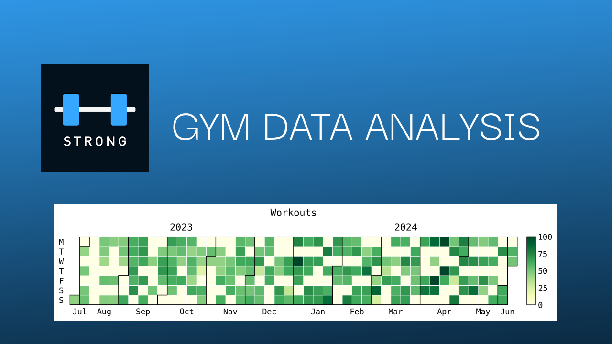

# Gym Data Analysis

I want to gain more insight on my gym stats which I record using the Strong app. The strong app already provides some good graph visualisation, but its very simple and very specific. Also I figured this would be a good project to practice my data analysis skills with python. I might extend this project to also include my fitbit data. 

